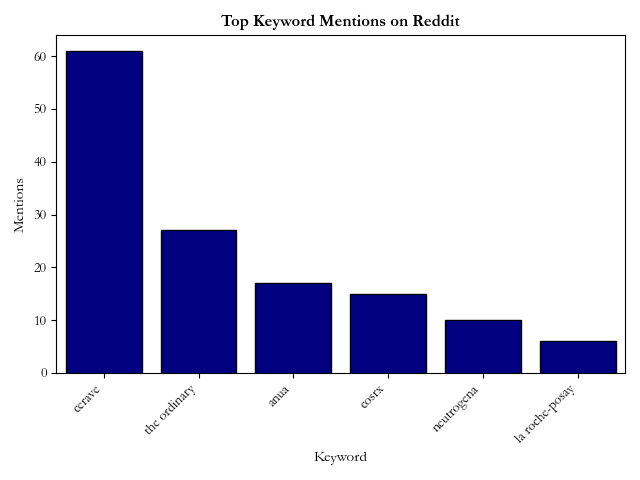

<h1 align="center">Trace</h1>

A simple desktop app that scrapes Reddit for user-defined keywords and subreddits, then displays trending mentions in a bar chart and CSV log.


## Tech Stack
- **Python**
- **PRAW (Reddit API)**
- **pandas**
- **matplotlib**

## How It Works
1. User defines subreddits and keywords 
2. Script fetches 300 latest posts from each subreddit
3. Counts keyword mentions across all post titles and texts
4. Outputs:
   - `reddit_mentions.csv`: Table of keyword frequencies, including trending information and date
   - `keyword_visualization.png`: Bar chart visualization
   - `trend_log.csv`: running csv file of all data collected to date

## Getting Started

1. Install dependencies:

```bash
pip install praw pandas matplotlib pyqt5
```

2. Set up your Reddit API credentials at https://www.reddit.com/prefs/apps

3. Set up .env:

```python
CLIENT_ID=your_id
CLIENT_SECRET=your_secret
USER_AGENT=your_agent
```

4. Optional: convert to .exe file with auto-py-to-exe


5. OR run script
```bash
python trace.py
```

## Sample Output
**Bar Chart**



**CSV**

``
Keyword,Mentions,Trending,Date
cerave,61,True,2025-06-16
the ordinary,27,False,2025-06-16
anua,17,False,2025-06-16
cosrx,15,False,2025-06-16
neutrogena,10,False,2025-06-16
la roche-posay,6,False,2025-06-16
``

## Future Ideas

- Time-based trend tracking
- Scrape comments 
- Web frontend

